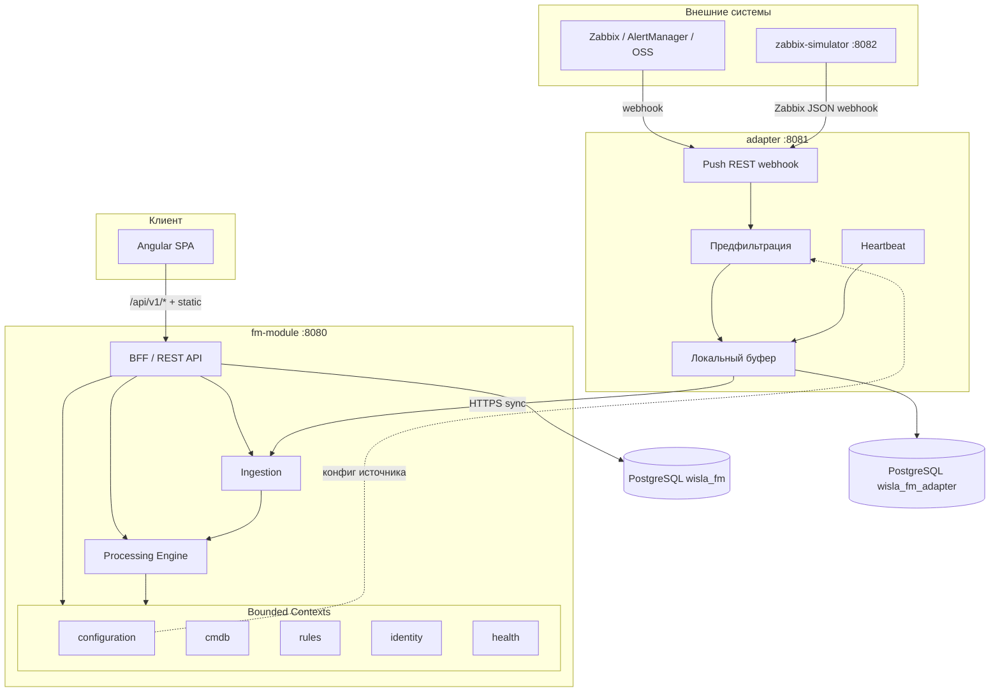
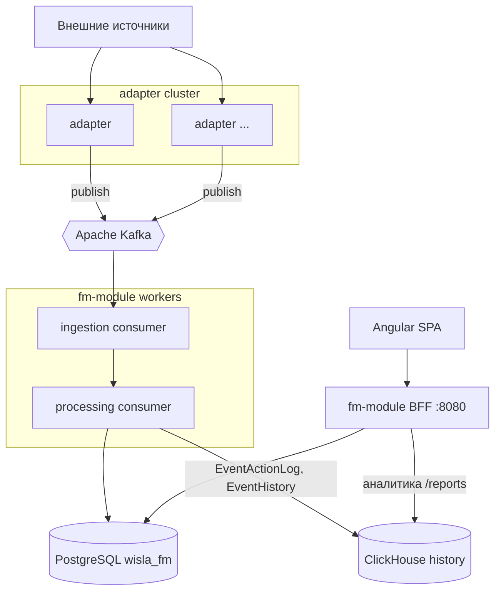
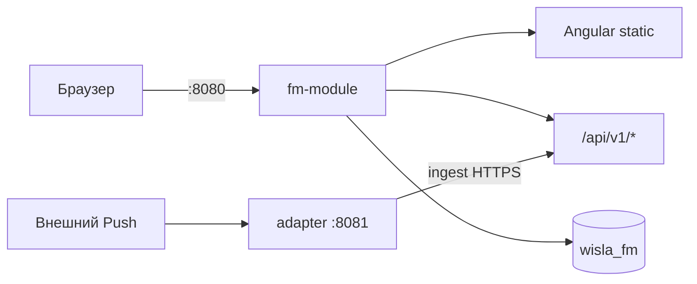

# Архитектура — WISLA Fault Management

**Версия:** 1.0  
**Источник:** `docs/requirements.md`, `docs/pages-spec.md`, `docs/tech-stack.md`, `prototype/`  
**СУБД:** PostgreSQL 15+ (отдельная база на каждый развёртываемый сервис)  
**Соглашения:** `snake_case`, UUID PK, `created_at` / `updated_at` на всех таблицах

---

## 1. Принципы декомпозиции (DDD)

| Принцип | Реализация в WISLA FM |
|---------|------------------------|
| **Bounded Context** | Два развёртываемых сервиса (`adapter`, `fm-module`); внутри `fm-module` — логические контексты (модули пакетов), единая PostgreSQL-база, границы агрегатов соблюдаются на уровне кода |
| **Database per Service** | `wisla_fm_adapter` — минимальное локальное состояние адаптера; `wisla_fm` — оперативные данные модуля. Кросс-сервисные FK **запрещены** |
| **Aggregate** | Транзакционная граница внутри одного сервиса; изменение `Event` + `EventActionLog` — одна транзакция в `fm-module` |
| **Domain Events** | MVP: синхронная доставка adapter → fm-module (HTTPS) + внутренние события Spring; Prod: публикация в Kafka для decoupling и репликации в ClickHouse |
| **UUID как сквозной ключ** | Все сущности — UUID; ссылки между сервисами — логические (`source_id`, `event_id`), без FK |
| **Денормализация read-моделей** | В `Event` хранятся снимки `node_fqdn`, `system_name` для консоли без join к CMDB на каждый запрос |
| **Исключения проекта** | Нет платформенного error-handling, метрик и application logging (см. `docs/requirements.md` п. 7); журнал действий оператора — доменный аудит в БД |

### 1.1. Развёртываемые единицы vs внутренние контексты

По утверждённому стеку система состоит из **двух deployable-сервисов**. Модуль FM — монолитный BFF (Spring Boot + Angular static), но в коде выделяются bounded contexts для будущего выделения без смены контрактов API.

| Deployable | Путь | Роль |
|------------|------|------|
| **adapter** | `backend/adapter/` | Приём Push, предфильтрация, буфер, heartbeat; проксирование в fm-module |
| **zabbix-simulator** | `backend/zabbix-simulator/` | MVP: имитация Zabbix 6.x webhook для демо-сценариев |
| **fm-module** | `backend/fm-module/` + `frontend/` | Ingestion API, движок обработки, PostgreSQL, REST для UI, раздача SPA |

### 1.2. Внутренние bounded contexts (`fm-module`)

| Контекст | Пакет (целевой) | Ответственность |
|----------|-----------------|-----------------|
| **ingestion** | `.../ingestion` | Приём сырых событий от адаптера, `RawEvent`, нормализация |
| **processing** | `.../processing` | `Event`, ЖЦ, дедупликация, problem–resolution, корреляция, `EventActionLog` |
| **rules** | `.../rules` | `ProcessingRule`, конструктор (canvas JSON), согласование |
| **configuration** | `.../configuration` | `EventSource`, API-ключи, тест подключения, статус адаптера |
| **cmdb** | `.../cmdb` | `ConfigurationItem`, автосоздание по FQDN, теги, продукты |
| **health** | `.../health` | `ProductHealth` (read-model), тепловая карта, drill-down |
| **identity** | `.../identity` | `User`, `Role`, JWT, `EventMap` (карты консоли), консоли доступа (post-MVP) |
| **settings** | `.../settings` | Параметры модуля, TZ, polling; интеграции и оповещения (post-MVP) |
| **downtime** | `.../downtime` | `Downtime`, подавление оповещений (post-MVP) |

---

## 2. Карта микросервисов

### 2.1. MVP (без Kafka)



### 2.2. Production (Kafka + ClickHouse)



---

## 3. Сводная таблица сервисов

### 3.1. Развёртываемые сервисы

| Сервис | Bounded Context (верхний уровень) | База данных | Основные агрегаты | Страницы UI |
|--------|-----------------------------------|-------------|-------------------|-------------|
| **adapter** | Ingest & Buffer | `wisla_fm_adapter` (минимальная) | `BufferedMessage`, `AdapterHeartbeat`, `SourceConfigSnapshot` | — (runtime для `/sources/*`; UI в fm-module) |
| **fm-module** | FM Core (ingestion + processing + configuration + cmdb + rules + health + identity + settings + downtime) | `wisla_fm` | см. таблицу 3.2 | все маршруты из `pages-spec.md` |

### 3.2. Агрегаты и страницы по контекстам (`fm-module`)

| Контекст | Агрегаты (корень) | Связанные сущности | Маршруты |
|----------|-------------------|--------------------|----------|
| **identity** | `User`, `Role` | permissions, team, session | `/login`, `/admin`, `/admin/users`, `/admin/roles`, `/admin/consoles` (post-MVP), профиль в `/settings` |
| **health** | `Product` (read-model) | агрегаты по `ci_id`, severity counters | `/`, `/health`, `/health/:productId` |
| **ingestion** | `RawEvent` | привязка к `source_id`, payload JSON | `/events/raw` |
| **processing** | `Event` | `EventActionLog`, `EventHistory` (post-MVP), root/child links | `/console`, `/console/:eventId` |
| **configuration** | `EventSource` | `credentials_ref`, `filter_rules`, adapter status | `/sources`, `/sources/new`, `/sources/:id` |
| **rules** | `ProcessingRule` | canvas definition, versions, `approval_status` | `/rules`, `/rules/new`, `/rules/:id` |
| **cmdb** | `ConfigurationItem` | tags, products, `external_ids`; `CiHealthProfile` (read-model) | `/admin/ci`, данные в `/health/:productId` |
| **identity (maps)** | `EventMap` | query, columns, personal/shared | `/admin/search-folders`, карты в `/console` |
| **settings** | `ModuleSettings`, `UserPreferences` | TZ, polling, ЖЦ intervals | `/settings`, `/settings/integrations` (post-MVP), `/settings/notifications` (post-MVP) |
| **downtime** | `Downtime` | scope, schedule, suppressed_actions | `/downtime`, `/downtime/new`, `/downtime/:id` (post-MVP) |
| **analytics** | — (read-model CH) | KPI, exports | `/reports` (post-MVP) |

### 3.3. Полный маппинг маршрутов → сервис

| Route | Сервис | Контекст | MVP |
|-------|--------|----------|-----|
| `/login` | fm-module | identity | да |
| `/` | fm-module | health + processing (счётчики) | да |
| `/health` | fm-module | health | да |
| `/health/:productId` | fm-module | health + cmdb | да |
| `/events/raw` | fm-module | ingestion | да |
| `/console` | fm-module | processing + identity (maps) | да |
| `/console/:eventId` | fm-module | processing | да |
| `/sources` | fm-module (+ adapter runtime) | configuration | да |
| `/sources/new` | fm-module | configuration | да |
| `/sources/:id` | fm-module (+ adapter runtime) | configuration | да |
| `/rules` | fm-module | rules | да |
| `/rules/new` | fm-module | rules | да |
| `/rules/:id` | fm-module | rules | да |
| `/admin` | fm-module | identity | да |
| `/admin/users` | fm-module | identity | да |
| `/admin/roles` | fm-module | identity | да |
| `/admin/ci` | fm-module | cmdb | частично |
| `/admin/search-folders` | fm-module | identity (maps) | да |
| `/admin/consoles` | fm-module | identity | post-MVP |
| `/downtime`, `/downtime/new`, `/downtime/:id` | fm-module | downtime | post-MVP |
| `/settings` | fm-module | settings + identity | да |
| `/settings/notifications` | fm-module | settings | post-MVP |
| `/settings/integrations` | fm-module | settings | post-MVP |
| `/reports` | fm-module (+ ClickHouse prod) | analytics | post-MVP |

---

## 4. Межсервисные связи

Кросс-сервисные связи — **логические UUID-ссылки** и **денормализованные снимки**. FK между `wisla_fm` и `wisla_fm_adapter` не создаются.

### 4.1. adapter → fm-module

| Направление | Механизм MVP | Механизм Prod | Данные |
|-------------|--------------|---------------|--------|
| adapter → fm-module | `POST /api/v1/ingest?sourceKey={key}` (sync HTTPS) | Publish в Kafka topic `fm.raw-events` | Нормализуемый JSON события, batch, heartbeat |
| fm-module → adapter | `GET /api/v1/internal/sources/{id}/config` (pull кэша) | То же + domain event `SourceConfigChanged` | `source_id`, `filter_rules`, `api_key` hash, endpoint |
| UI тест источника | fm-module оркестрирует probe через adapter | То же | Результат success/fail в `EventSource.last_success_at` |

### 4.2. Логические ссылки внутри fm-module (без кросс-сервисных FK)

| Поле | Тип связи | Денормализованный снимок |
|------|-----------|--------------------------|
| `events.source_id` | UUID → `event_sources.id` | — |
| `events.ci_id` | UUID → `configuration_items.id` | `node_fqdn`, `system_name`, `subsystem_name` |
| `events.assigned_user_id` | UUID → `users.id` | отображаемое имя в API response (не в таблице event) |
| `events.root_event_id` | UUID → `events.id` | — |
| `event_action_logs.event_id` | UUID → `events.id` | `user_name` в записи журнала |
| `raw_events.source_id` | UUID → `event_sources.id` | `source_name` в list API |
| `products.ci_ids[]` | UUID[] → `configuration_items.id` | `name`, `tenant`, `site`, `max_severity` — read-model |
| `configuration_items.products[]` | строковые id продуктов | связь M:N через массив или join-таблицу внутри сервиса |

### 4.3. adapter: локальное состояние

| Таблица | Назначение |
|---------|------------|
| `buffered_messages` | Очередь при недоступности fm-module; retry по расписанию |
| `source_config_snapshots` | Кэш `source_id`, `api_key`, `filter_rules` с TTL |
| `adapter_heartbeats` | Исходящие heartbeat-записи (audit локально) |

### 4.4. Внешние интеграции (post-MVP, из fm-module)

| Система | Направление | Идентификаторы |
|---------|-------------|----------------|
| WISLA | fm-module → WISLA | `external_ids` на КЕ, маппинг event id |
| ITSM | fm-module ↔ ITSM | `itsm_incident_number` на Event (MVP — поле-заглушка) |
| Active Directory | AD → fm-module | `users.external_id`, группы → роли |

---

## 5. Доменные события

### 5.1. Межсервисные (adapter ↔ fm-module)

| Событие | Издатель | Подписчики MVP | Подписчики Prod | Назначение |
|---------|----------|----------------|-----------------|------------|
| `RawEventReceived` | adapter | fm-module (sync HTTP handler) | fm-module ingestion consumer | Сырое/полусырое событие от источника |
| `AdapterHeartbeatSent` | adapter | fm-module | fm-module | Обновление `last_success_at`, статус адаптера |
| `IngestBatchAccepted` | fm-module | — | adapter (ack, optional) | Подтверждение приёма пакета |
| `IngestRejected` | fm-module | adapter (buffer retry) | adapter | Ошибка валидации / недоступность БД модуля |
| `SourceConfigChanged` | fm-module | adapter (poll / push config) | adapter via Kafka | Инвалидация кэша `source_config_snapshots` |
| `SourceBlocked` | fm-module | adapter (block ingress) | adapter | Шторм: блокировка источника на адаптере |

### 5.2. Внутренние (fm-module)

| Событие | Издатель | Подписчики | Назначение |
|---------|----------|------------|------------|
| `EventCreated` | processing | health (read-model), rules engine | Новое FM-событие после нормализации |
| `EventUpdated` | processing | health, UI polling clients | Смена severity, status, assignment |
| `EventDeduplicated` | rules | processing, action log | `repeat_count`, `last_repeat_at` |
| `EventCorrelated` | rules | processing | `root_event_id`, `child_event_ids` |
| `EventClosed` | processing | health, ITSM stub | Закрытие ЖЦ |
| `OperatorActionRecorded` | processing | — | Запись в `event_action_logs` |
| `CiAutoCreated` | cmdb | processing | Новый КЕ по FQDN при ingest |
| `ProductHealthRecalculated` | health | — | Обновление тепловой карты |
| `RuleApproved` | rules | rules engine | Активация правила корреляции |
| `DowntimeActivated` | downtime | processing | Статус «Обслуживание» (post-MVP) |
| `DowntimeCompleted` | downtime | processing, notifications | Возврат событий, автозапуск оповещений (post-MVP) |

### 5.3. Production: Kafka topics (целевые)

| Topic | Producer | Consumer | Payload |
|-------|----------|----------|---------|
| `fm.raw-events` | adapter | fm-module ingestion | Raw ingest DTO |
| `fm.config-events` | fm-module | adapter | `SourceConfigChanged`, `SourceBlocked` |
| `fm.domain-events` | fm-module | ClickHouse sink, analytics | `Event*`, `OperatorActionRecorded` |

---

## 6. API Gateway / BFF

### 6.1. MVP — единая точка входа на fm-module

Отдельный API Gateway **не развёртывается**. Сервис `fm-module` на порту **8080** выполняет роли:

| Роль | Реализация |
|------|------------|
| **Static host** | Раздача собранного Angular SPA (`/`, `/console`, …) |
| **BFF / REST API** | `/api/v1/*` — все операции UI, агрегация для Dashboard и `/health` |
| **Ingestion endpoint** | `/api/v1/ingest` — приём от adapter (Bearer / API-key источника) |
| **Auth** | `POST /api/v1/auth/login` → JWT; проверка ролей на контроллерах |



**Маршрутизация запросов UI (примеры):**

| UI действие | BFF endpoint |
|-------------|--------------|
| Polling консоли | `GET /api/v1/events` |
| Принять в работу | `POST /api/v1/events/{id}/actions` |
| Тепловая карта | `GET /api/v1/health/products` |
| Список источников | `GET /api/v1/sources` |
| Тест источника | `POST /api/v1/sources/{id}/test` |
| Карты событий | `GET /api/v1/console/maps` |

### 6.2. adapter (отдельный порт)

| Параметр | Значение |
|----------|----------|
| Порт MVP | **8081** |
| Публичный webhook | `{adapterBase}/webhook/{sourceKey}` — приём от Zabbix/AlertManager |
| Исходящий вызов | `{fmModuleBase}/api/v1/ingest?sourceKey={key}` |

### 6.3. Production — эволюция BFF

| Компонент | Изменение |
|-----------|-----------|
| **fm-module** | Остаётся BFF для UI; ingestion может выноситься в отдельные consumers |
| **Kafka** | Замена sync HTTPS adapter→fm-module на async pipeline |
| **ClickHouse** | BFF читает историю/отчёты из CH; оперативные данные — PostgreSQL |
| **API Gateway** | Опционально: внешний reverse proxy (nginx) с TLS termination; единый `baseUrl` для SPA и `/api` |

JWT и матрица ролей (`pages-spec.md`) применяются на уровне BFF; adapter аутентифицируется **сервисной учётной записью** / API-ключом источника, не пользовательским JWT.

---

## 7. Хранилища данных

| Хранилище | MVP | Production | Содержимое |
|-----------|-----|------------|------------|
| PostgreSQL `wisla_fm` | да | да | События, КЕ, источники, правила, пользователи, журнал действий (MVP) |
| PostgreSQL `wisla_fm_adapter` | да | да | Буфер, снимки конфигурации, heartbeat |
| ClickHouse | нет | да | `event_action_logs`, `event_history`, агрегаты `/reports` |

---

## 8. Структура репозитория

```
backend/
  adapter/                 # Spring Boot — Push, буфер, heartbeat
  fm-module/               # Spring Boot — API, processing, Liquibase, static Angular
frontend/                  # Angular 18+ → build в fm-module resources
docs/
  architecture.md          # этот документ
  adapter/api.yaml         # Agent 06
  adapter/db.md
  fm-module/api.yaml
  fm-module/db.md
```

---

## 9. Следующие шаги

| Артефакт | Агент | Статус |
|----------|-------|--------|
| `docs/adapter/api.yaml`, `db.md` | 06-api-designer | готово |
| `docs/fm-module/api.yaml`, `db.md` | 06-api-designer | готово |
| `docs/api-gateway.yaml` | 06-api-designer | готово |

---

*Документ подготовлен Architect (agent 05). Детализация таблиц и OpenAPI — в `docs/{service}/db.md` и `api.yaml`.*
