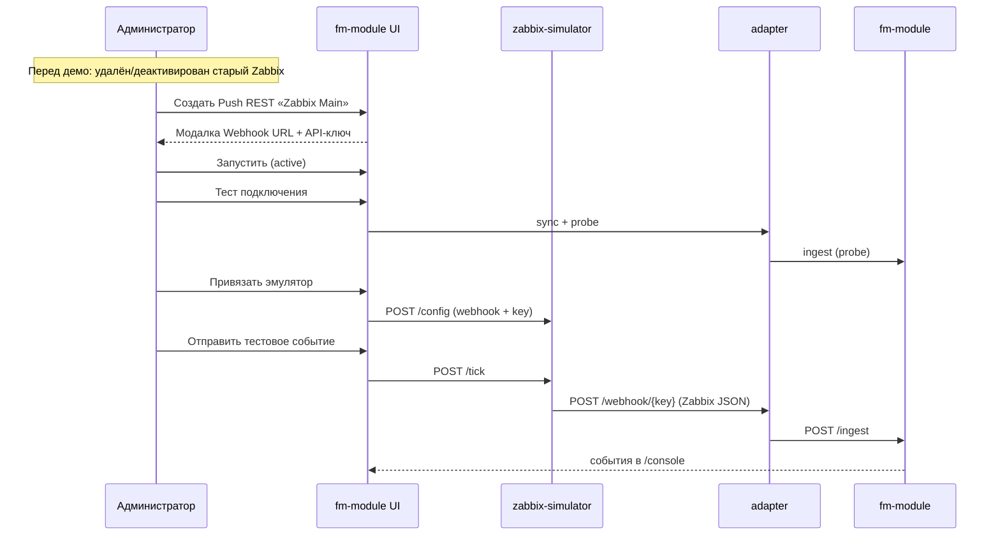

# Демо-сценарий: новый источник + эмулятор Zabbix (только UI)

**Длительность:** 10–12 минут  
**Аудитория:** администратор платформы, инженер мониторинга  
**Цель:** с нуля создать Push REST-источник, привязать **zabbix-simulator** через UI (аналог настройки Zabbix Media Type) и показать живые алерты в консоли.

**Легенда:** разворачиваем интеграцию с Zabbix заново — в реестре нет нашей интеграции, подключаем стендовый Zabbix (эмулятор).

> Весь сценарий выполняется **в браузере**. Терминал нужен только для опционального старта стека (шаг подготовки). DevTools, PowerShell-скрипты и docker override **не используются**.

---

## Цепочка доставки

```
zabbix-simulator :8082
  → POST adapter:8081/webhook/{webhookKey}  (+ X-Source-Key)
    → adapter → POST fm-module /api/v1/ingest
      → /console, /events/raw
```

Эмулятор **никогда** не вызывает fm-module напрямую — только adapter. Привязка через UI настраивает симулятор так же, как в реальном Zabbix прописывают URL webhook и секретный ключ в Media Type.

---

## Подготовка перед демо (за кулисами, ~3–5 мин)

### 1. Поднять стек (опционально, в терминале)

```powershell
cd C:\Project\wislaFaultManagement\backend
docker compose up -d
```

Дождаться healthcheck всех сервисов (~1–2 мин).

| Сервис | URL |
|--------|-----|
| UI + fm-module | http://localhost:8080 (`admin` / `admin`) |
| adapter | http://localhost:8081 |
| zabbix-simulator | http://localhost:8082 |

### 2. Очистить реестр от seeded-источника (в UI)

1. Войти: http://localhost:8080 → `admin` / `admin`
2. **Сбор данных → Источники**
3. Открыть карточку **Zabbix Main (simulator)** (создаётся при dev-seed)
4. **Удалить** → подтвердить

> **Если удаление недоступно** (источник связан с событиями): нажать **Остановить** (деактивация) или подтвердить деактивацию в диалоге 409. Для live-демо создадим новый источник с именем `Zabbix Main`.

5. Вернуться на `/sources` — в списке не должно остаться активной интеграции Zabbix (или только деактивированный старый источник).

### 3. Проверить карточку «Сервис адаптера»

На `/sources` сверху: статус **Работает**, fm-module **доступен**, буфер 0 (или небольшой). Это покажем зрителю на шаге 1.

---

## Что показываем зрителю

| # | Экран | Эффект |
|---|--------|--------|
| 1 | `/sources` — без активного Zabbix | «Интеграции ещё нет» |
| 2 | Создание + модалка credentials | Webhook URL и API-ключ один раз |
| 3 | Карточка: активация, тест, привязка | Всё в UI, без терминала |
| 4 | «Отправить тестовое событие» | PROBLEM с demo-server, db-prod-01… |
| 5 | `/console` | Живые Zabbix-сценарии |
| 6 | `/sources` | «Последний успех», адаптер «Запущен» |

---

## Сценарий (live, только UI)

### Шаг 1. Пустой реестр (1 мин)

1. **Сбор данных → Источники**

**Реплика:**

> «Сейчас Zabbix к платформе не подключён. Покажем полный цикл: регистрируем источник в FM, получаем webhook и ключ, настраиваем Zabbix — у нас это эмулятор — и получаем поток событий.»

Показать карточку **Сервис адаптера** (adapter up, fm-module доступен).

---

### Шаг 2. Создание источника (2 мин)

1. **+ Создать**
2. Заполнить:

   | Поле | Значение |
   |------|----------|
   | Название | `Zabbix Main` |
   | Тип | `Push REST` |
   | Протокол | `HTTPS/REST` |
   | Endpoint | `https://zabbix.wisla.local` |

   > Endpoint — URL **внешнего** Zabbix (как в Monq «адрес системы-источника»). Webhook FM сгенерирует отдельно.

3. **Создать**

4. **Модальное окно «Данные для подключения»** (появляется сразу после создания):
   - **Webhook URL** — вид `http://localhost:8081/webhook/xxxxxxxx`
   - **API-ключ** — полный plaintext (`zk-…`)
   - Кнопки **Копировать** у каждого поля
   - Предупреждение: «Сохраните ключ — повторно он не отображается»

5. **Перейти к карточке** → `/sources/{id}`

**Реплика:**

> «Источник создан неактивным. FM выдал уникальный Webhook URL и API-ключ — их нужно прописать в Zabbix Media Type. Ключ показывается один раз; UI запоминает его в текущей сессии браузера для теста и привязки эмулятора.»

На карточке в блоке **Получение данных** показать **Webhook URL** (тот же, что в модалке) и маскированный API-ключ.

---

### Шаг 3. Активация и тест подключения (2 мин)

1. В шапке карточки нажать **Запустить** → статус меняется на **Активен** (badge зелёный)

2. Нажать **Тест подключения** (в блоке «Получение данных»)

   - fm-module синхронизирует конфиг на adapter и выполняет probe
   - Результат под кнопкой: success/fail, доставка (`доставлено` / `в буфере` / `ошибка`), задержка в мс
   - Зелёный блок — probe прошёл; жёлтый — событие в буфере adapter (fm-module был недоступен)

> **Если открыли карточку в новой вкладке** (ключ не в sessionStorage): появится модалка «Введите API-ключ источника» — вставить ключ, скопированный на шаге 2.

**Реплика:**

> «Активируем источник и проверяем цепочку adapter → fm-module. В продукте Zabbix на этом этапе уже знает наш webhook; здесь — реальный probe через adapter.»

---

### Шаг 4. Привязка эмулятора Zabbix (2 мин)

Прокрутить до блока **Эмулятор Zabbix**:

1. Badge **Не привязан** → нажать **Привязать эмулятор**
   - fm-module передаёт webhook key и API-ключ в zabbix-simulator (`POST /config`) и синхронизирует adapter
   - Badge меняется на **Привязан**
   - В статусе: `adapterWebhookUrl` совпадает с Webhook URL на карточке, счётчик активных проблем

2. Убедиться, что переключатель **Автотик** **выключен** (рекомендуется до первого ручного теста)

**Реплика:**

> «В Zabbix в Media Type указывают URL webhook FM и секретный ключ. Мы сделали то же самое одной кнопкой — эмулятор шлёт JSON как Zabbix 6.x: trigger_name, event_nseverity, recovery через event_value=0.»

По желанию показать [`docs/zabbix-simulator.md`](../zabbix-simulator.md) — таблицу полей payload.

---

### Шаг 5. Первое событие (1–2 мин)

1. Нажать **Отправить тестовое событие**
2. Под кнопками — результат: тип (`проблема` / `восстановление` / …), доставлено да/нет, HTTP-статус
3. Ссылка **Открыть консоль** → `/console`

**Реплика:**

> «Zabbix отправил PROBLEM. Adapter проверил ключ, смапил severity и передал в модуль. Дальше — dedup и threshold из наших правил.»

*(Опционально)* включить **Автотик** — симулятор будет слать события каждые ~90 с. Для демо удобнее ручная кнопка.

---

### Шаг 6. Консоль и обратная связь (2 мин)

1. **Консоль событий** (`/console`) — алерты из сценариев:
   - `High CPU utilization…` → `demo-server.wisla.local`
   - `Disk space critically low` → `db-prod-01.moscow.company.ru`
   - и т.д.
2. **Первичные события** (`/events/raw`) — сырой ingest
3. **Источники** — у `Zabbix Main`:
   - статус **Запущен**
   - колонка **Адаптер** → «Запущен» (после успешного ingest)
   - **Последний успех** — обновится в течение ~30 с (polling списка)

**Реплика:**

> «Источник живой: видим last success и runtime адаптера. Если fm-module недоступен — adapter буферизует и догонит позже.»

---

### Шаг 7. (Опционально) Автотик и recovery (~1 мин)

1. На карточке включить **Автотик** — периодическая отправка сценариев
2. Повторные **Отправить тестовое событие** могут дать `восстановление`, если симулятор выбрал recovery-сценарий

**Реплика:**

> «Recovery в Zabbix — event_value=0. В MVP автозакрытие по problem-resolution ещё не в правилах, но сырой recovery виден в первичных событиях.»

---

## Схема для слайда



---

## Шпаргалка ведущего (UI-only)

| Действие | Где в UI |
|----------|----------|
| Старт стека | `docker compose up -d` в `backend\` (до зала) |
| Убрать seeded Zabbix | `/sources` → карточка → **Удалить** или **Остановить** |
| Создать источник | `/sources/new` → **Создать** |
| Сохранить credentials | Модалка после создания → **Копировать** |
| Активировать | Карточка → **Запустить** |
| Проверить цепочку | **Тест подключения** |
| Настроить «Zabbix» | Блок «Эмулятор Zabbix» → **Привязать эмулятор** |
| Первое событие | **Отправить тестовое событие** → **Открыть консоль** |
| Поток событий | Включить **Автотик** |

---

## Чеклист

- [ ] Стек поднят (`docker compose up -d`)
- [ ] Seeded Zabbix удалён или деактивирован через UI
- [ ] Карточка «Сервис адаптера» — Работает
- [ ] После создания — модалка credentials, ключ скопирован
- [ ] Источник **Запущен**, тест подключения — success
- [ ] Эмулятор **Привязан**, Webhook в статусе совпадает с карточкой
- [ ] **Отправить тестовое событие** → события в `/console`
- [ ] На `/sources` обновился «Последний успех»

---

## Запасной план

| Симптом | Причина | Действие в UI |
|---------|---------|---------------|
| «Введите API-ключ» | Новая вкладка / сессия | Вставить ключ из модалки создания |
| Тест подключения fail | Источник inactive или неверный ключ | **Запустить**; пересоздать ключ (**Сгенерировать новый ключ**) |
| Эмулятор «Недоступен» | zabbix-simulator down | Перезапустить стек; обновить страницу |
| Привязка не меняет badge | Старый webhook key на симуляторе | Повторить **Привязать эмулятор** |
| `доставлено: нет` при тике | Источник inactive / неверный ключ | **Запустить**, **Привязать эмулятор** заново |
| `"delivery":"buffered"` в тесте | fm-module down | Проверить карточку адаптера; перезапустить стек |
| Нет событий в console | Фильтры UI | Сбросить фильтры, проверить `/events/raw` |
| Не удаляется старый источник | Есть события в БД | **Остановить** + создать источник с новым именем |
| Долго нет автособытий | Автотик выключен | Включить **Автотик** или жать **Отправить тестовое событие** |

---

## Ограничения MVP (если спросят)

| Что | Сейчас |
|-----|--------|
| Настройка реального Zabbix | Media Type вручную; в демо — кнопка «Привязать эмулятор» |
| API-ключ после создания | Только модалка + sessionStorage текущей вкладки |
| Автозакрытие по recovery | Не в движке правил MVP |
| Pull ETL / SNMP Trap | В реестре типы есть; полный цикл — post-MVP |

---

## Связанные документы

- [`docs/pages-spec.md`](../pages-spec.md) — экран «Источники», демо-блок
- [`docs/zabbix-simulator.md`](../zabbix-simulator.md) — сценарии и формат payload
- [`docs/adapter/connect-zabbix-source.md`](../adapter/connect-zabbix-source.md) — второй экземпляр adapter
