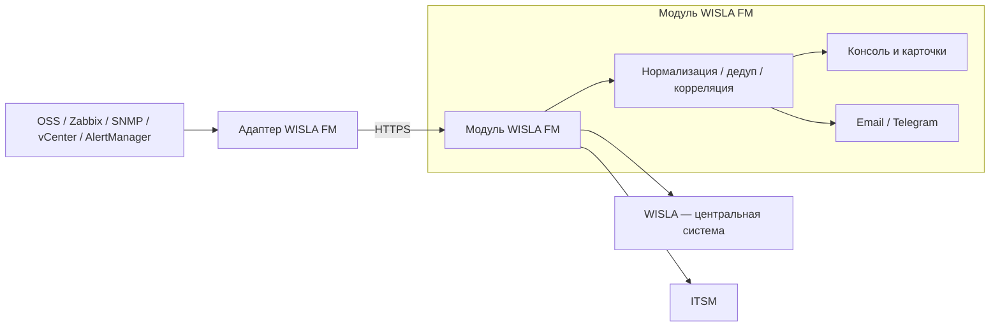
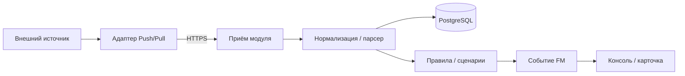
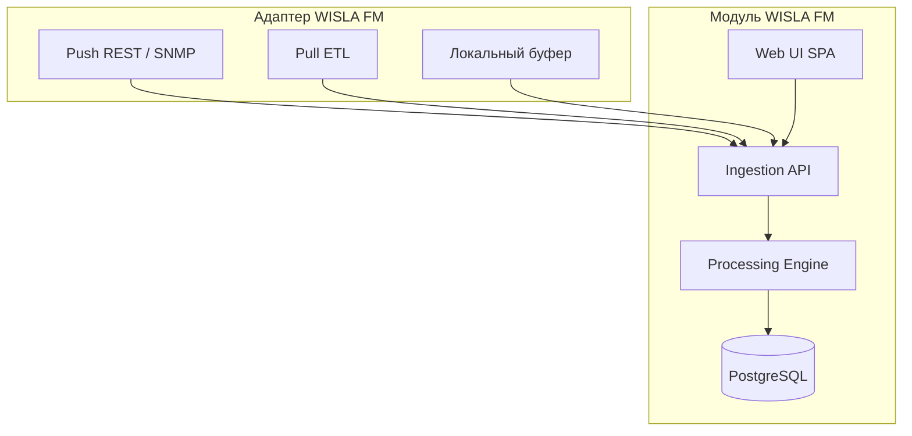

# Требования — WISLA Fault Management

**Версия:** 1.0 (MVP + полное ТЗ)  
**Источник:** `output.md` — ТЗ «Fault Management»  
**Визуальный референс:** [Monq](https://monq.ru/), `Monq_9._Technical_presentation.pdf` — корпоративный ИТ-мониторинг, тёмная профессиональная палитра, консоль оператора, дашборды «Здоровье продуктов», тепловые карты.

---

## 1. Обзор (Overview)

### 1.1. Назначение

**WISLA Fault Management (WISLA FM)** — модуль приёма, нормализации, обработки и отображения аварийных событий мониторинга с разнородного оборудования и систем (OSS, средства мониторинга, SNMP-источники, Zabbix, AlertManager, vCenter и др.).

**WISLA** — центральная система мониторинга организации; **WISLA FM** — отдельный модуль, который может интегрироваться с WISLA, но не является её заменой.

### 1.2. Состав решения

| Компонент | Назначение |
|-----------|------------|
| **Адаптер WISLA FM** | Приём Push (REST, SNMP Trap) или опрос Pull (ETL по расписанию); первичная фильтрация; передача событий в модуль по HTTPS |
| **Модуль WISLA FM** | Серверная обработка, хранилище, правила, UI (консоль, карточки, админка), интеграции с WISLA и ITSM |

Серверная часть, обработчик событий и веб-интерфейс — **части одного модуля WISLA FM**. Адаптер — **отдельный развёртываемый компонент**.

### 1.3. Поток данных

**Уровни обработки:** collection (приём) → aggregation (обработка, корреляция) → display (консоль, дашборды).

### 1.4. Термины

| Термин | Определение |
|--------|-------------|
| Событие мониторинга | Унифицированная запись об аварии/отклонении с атрибутами, критичностью, статусом ЖЦ и связью с КЕ |
| КЕ | Конфигурационный элемент — узел, система, оборудование, сервис |
| Корневая причина | Событие, идентифицированное как первопричина группы связанных (симптоматических) событий |
| Downtime (DT) | Окно обслуживания; события по затронутым КЕ переводятся в статус «Обслуживание» |

### 1.5. Технологический ориентир (из ТЗ)

Java или Node.js (backend), React или Angular (frontend), PostgreSQL (оперативные данные), ClickHouse или аналог (история/аналитика). ОС: OEL 8+/9+, RedOS 7+/8+, Astra Linux. WEB, приложения и БД — на отдельных серверах.

---

## 2. Роли пользователей (User Roles)

| Роль | Описание | Основные полномочия |
|------|----------|---------------------|
| **Дежурный инженер** | Оператор консоли, первичная реакция на аварии | Просмотр консоли и дашбордов в рамках тенанта/группы; взятие в работу; комментарии; закрытие; ручная корреляция; поиск по объекту |
| **Специалист мониторинга** | Углублённая работа с событиями и правилами | Все действия дежурного + настройка папок поиска, расписаний действий (в рамках тенанта), ручная корреляция/развязывание, управление DT |
| **Администратор системы** | Настройка модуля без доступа к БД | Управление пользователями, ролями, источниками, правилами корреляции, DT, оповещениями, КЕ, группами/тегами, консолями по разграничению доступа |
| **Согласующий правил** (спец. роль) | Контроль изменений правил корреляции | Создание/изменение правил корреляции — через согласование; фиксация в истории |
| **Сервисная учётная запись** | API-интеграции (адаптеры, внешние системы) | Push/Pull событий, управление ЖЦ через API в пределах выданных прав |

**Аутентификация:** локальные учётные записи и/или Active Directory (LDAP с TLS). **Авторизация:** настраиваемая ролевая модель через админ-панель; многоуровневый доступ по группам AD.

**Разграничение консолей:** пользователи видят события по тенанту, группе, тегу, роли — настраиваемые «консоли событий».

---

## 3. Основные сущности (Core Entities)

### 3.1. Событие мониторинга (`Event`)

**Идентификатор:** UUID.

| Атрибут | Тип / значения | Обязательность |
|---------|----------------|----------------|
| id | UUID | да |
| status | `new` \| `in_progress` \| `closed` \| `archived` \| `maintenance` \| `deferred` | да |
| severity | `fatal` \| `critical` \| `major` \| `minor` \| `warning` \| `normal` | да |
| priority | строка (из метрики/labels) | нет |
| title | строка | да |
| description | текст | нет |
| assigned_user_id | UUID | нет |
| assigned_team_id | UUID | нет |
| repeat_count | integer (при дедупликации) | да, default 1 |
| instructions | текст | нет |
| ci_id | UUID → КЕ | да |
| node_fqdn | строка | нет |
| system_id, system_name | строка | нет |
| subsystem_id, subsystem_name | строка | нет |
| software, sol_code | строка | нет |
| related_products | массив | нет |
| root_event_id | UUID (корневая причина) | нет |
| child_event_ids | массив UUID | нет |
| itsm_incident_number | строка | нет |
| rfc_id | UUID (связь с DT/RFC) | нет |
| source_id | UUID → Источник | да |
| custom_fields | JSON (расширяемая модель) | нет |
| timestamps | `source_at`, `created_at`, `last_repeat_at`, `taken_at`, `closed_at` | частично |

**CRUD:** создание — адаптер/API; чтение/обновление — оператор, API; удаление — по правилам автоочистки и API (закрытие предпочтительнее).

**Связанные сущности:** журнал действий (`EventActionLog`), история изменений атрибутов (`EventHistory`), связанные/дочерние события.

### 3.2. Конфигурационный элемент (`ConfigurationItem`, КЕ)

| Атрибут | Описание |
|---------|----------|
| id | UUID |
| fqdn | FQDN узла |
| ci_type | тип КЕ (узел, система, оборудование, сервис) |
| system, subsystem | принадлежность |
| software | ПО |
| products | продукты-потребители/поставщики |
| tags | тенант, площадка, продукт, критичность |
| external_ids | маппинг с IMS/SOL/PPInfo, WISLA |

**CRUD:** администратор — полный; автосвязь при поступлении события; чтение — все роли в рамках доступа.

### 3.3. Источник событий (`EventSource`)

| Атрибут | Описание |
|---------|----------|
| id | UUID |
| name | наименование |
| type | `push_rest` \| `push_snmp_trap` \| `pull_etl` |
| protocol | HTTPS/REST, SNMP v2/v3, и др. |
| endpoint | URL / host:port |
| credentials_ref | ссылка на зашифрованные учётные данные |
| schedule | cron/расписание (для Pull) |
| adapter_version | версия адаптера |
| last_success_at | время последней успешной передачи/опроса |
| status | `active` \| `inactive` \| `blocked` (при шторме) |
| filter_rules | предварительная фильтрация на адаптере |
| isolation_group | группа изоляции источников |

**CRUD:** администратор. **Тест подключения** — обязателен перед сохранением.

### 3.4. Правило обработки (`ProcessingRule`)

Типы: **дедупликация**, **problem–resolution**, **корреляция** (time-based, топологическая, потоковая, rule-based), **шторм**, **расписание**, **автоматизация**.

| Атрибут | Описание |
|---------|----------|
| id, name, enabled | идентификация и статус |
| rule_type | тип правила (legacy; используется при пустом `canvas`) |
| canvas | JSON `{ nodes[], edges[] }` — **исполняемая** схема конструктора; runtime интерпретирует блоки включённых правил при каждом сыром событии |
| conditions | фильтры атрибутов (=, !=, like), временное окно, лаг |
| actions | слияние, создание синтетического события, блокировка источника, смена статуса |
| last_run_at | время последнего срабатывания action-блока |
| approval_status | для корреляции — согласование |
| version, history | версионирование |

**Canvas runtime (MVP+):** блоки trigger (stream), condition, switch, dedup, threshold, correlation, **notify**, **push**. Switch — первая подходящая ветка; correlation — `count`/`windowMin`, связь root/child в консоли. **notify** — исходящее оповещение по каналу `telegram` или `email` (параметр `emailAddress` обязателен для email); в MVP+ — **заглушка** (фиксация намерения, без реальной отправки). **push** — in-app toast для оператора: запись в `rule_push_notifications`, доставка UI через polling `GET /api/v1/notifications/push?since=`. Валидация canvas при сохранении/активации (`notify_missing_channel`, `notify_invalid_email`). Блок status — post-MVP. Реальная отправка SMTP/Telegram — post-MVP.

**CRUD:** администратор / специалист (в рамках тенанта); согласующий — approve.

### 3.5. Downtime (`Downtime`)

| Атрибут | Описание |
|---------|----------|
| id | UUID |
| type | `permanent` (из расписания мониторинга) \| `temporary` (регламентные работы) |
| scope | ИС, отдельные КЕ, РСМ |
| schedule | однократно / по расписанию; start+end или start+duration |
| status | `planned` \| `active` \| `completed` \| `cancelled` |
| suppressed_actions | оповещения, инциденты — автозапуск после окончания |

**CRUD:** специалист мониторинга, администратор; API.

### 3.6. Пользователь и роль (`User`, `Role`, `Permission`)

Настраиваемые роли с набором полномочий (просмотр консоли, действия над событием, управление источниками, правилами, DT, админка). Провиженинг из AD по группам.

### 3.7. Папка поиска / быстрый фильтр (`SearchFolder`)

Преднастроенный набор фильтров консоли; настраивается администратором; применение с Dashboard — не более 3 кликов после авторизации.

### 3.8. Правило оповещения (`NotificationRule`)

Критерии: критичность, статус, тип, источник. Каналы: email, Telegram. Получатели: по правилам, командам, графикам дежурств. Подавление в период DT.

### 3.9. Продукт / здоровье продукта (`Product`, `ProductHealth`)

Агрегированное представление для дашборда «Здоровье продуктов»: степень деградации, тепловая карта, drill-down в карточку продукта и связанные события.

**Дельта health-product-crud:** администратор создаёт, редактирует и удаляет продукты через UI `/health` и `/health/:productId` без правки seed/БД. API: `POST/PATCH/DELETE /api/v1/admin/products` (поля `name`, `code`, `tenant`, `site`, `tags`; `maxSeverity` и `activeEventCount` — только read-only агрегаты). Связь M:N с КЕ — поле `ciIds` в create/patch (полная замена `product_ci`, вариант B со стороны продукта). Удаление продукта с привязанными КЕ — **409** («сначала отвяжите КЕ»); отвязка через блок «Состав продукта» на карточке продукта.

### 3.10. Журнал действий (`EventActionLog`)

Фиксация действий оператора и системы: взятие в работу, комментарий, смена статуса, корреляция, закрытие, действия по DT. Хранение в исторической БД.

### 3.11. Адаптер (компонент)

Не доменная сущность БД модуля, а **развёртываемый сервис** с конфигурацией: привязка к `EventSource`, локальный буфер при недоступности модуля, heartbeat, передача пакетов JSON.

---

## 4. Бизнес-правила (Business Rules)

### 4.1. Приём и нормализация

1. События поступают **только через адаптеры** (Push/Pull), не напрямую в WISLA.
2. Адаптер передаёт в модуль по **HTTPS** с аутентификацией; формат JSON; нормализация к единой внутренней схеме (допускается приведение к CEF на этапе нормализации).
3. Типы сообщений: событие (new/update/close), heartbeat адаптера, служебные (ошибка Pull-задания).
4. При поступлении — **автоматическая привязка к КЕ** в конфигурационной базе; при отсутствии КЕ — создание или очередь на сопоставление (политика настраивается).
5. При поступлении одного логического события из нескольких источников — **обогащение**, не дублирование.
6. Предварительная **фильтрация на адаптере** до передачи в модуль.
7. **Изоляция источников:** сбой одного источника не деградирует обработку других.
8. **Буфер адаптера** при недоступности модуля; **буфер модуля** (временные файлы) при недоступности БД — с последующей доставкой.

### 4.2. Дедупликация и Problem–Resolution

- **Дедупликация:** одинаковые сообщения сливаются в одно событие с `repeat_count`, `first_at`, `last_repeat_at`.
- **Problem–Resolution:** закрывающее сообщение находит активную аварию и очищает/закрывает её (пример: «Недоступность порта» / «Доступность порта»).

### 4.3. Жизненный цикл события

**Статусы:** Новый → В работе → Закрыт | Архив | Обслуживание | Отложен.

| Переход | Условие |
|---------|---------|
| Новый → В работе | Оператор взял в работу; или авто-регистрация инцидента ITSM |
| Новый → Обслуживание | КЕ в активном DT |
| Новый → Закрыт | Метрика Normal до взятия в работу |
| В работе → Отложен | Оператор отложил с указанием срока |
| В работе → Закрыт | Метрика Normal или ручное закрытие |
| Закрыт → Новый | Повтор в заданном интервале |
| Закрыт → В работе | Повтор при ранее назначенном исполнителе |
| Закрыт → Архив | По истечении срока хранения в активном списке |
| Обслуживание → Новый / Закрыт | По завершении DT и состоянию метрики |
| Отложен → В работе / Закрыт / Новый | По сроку, вручную или закрывающему событию |

**Дополнительные правила:**
- Запрет одновременной обработки одним событием несколькими пользователями — **сигнализация конфликта** при попытке взятия.
- Сигнализация при непоступлении закрывающего события в заданный период.
- Сигнализация при отсутствии реакции оператора в заданный срок.
- Автоочистка из активного списка по правилам (критичность, таймер, очищающее сообщение).
- Обратный перевод из решённого в активное при повторном возникновении.

### 4.4. Корреляция

- Типы: time-based, топологическая (по связям КЕ в CMDB), потоковая, rule-based (no-code фильтры), историчность (полное ТЗ).
- Формирование **синтетического** события из группы; отображение корневой причины и симптоматических дочерних.
- **Ручная** корреляция и развязывание оператором.
- Поиск похожих ранее локализованных аварий (полное ТЗ).
- Изменения правил корреляции — через **согласование** (роль согласующего).

### 4.5. Downtime

- При активном DT: статус события **Обслуживание**, обогащение информацией о DT, **скрытие** из консоли дежурных, пометка «не решено в период DT».
- События начала/окончания DT; принудительная остановка активного DT.
- Подавлённые оповещения/инциденты — **автозапуск** после окончания DT, если событие актуально.

### 4.6. Защита от шторма событий

- Выявление аномального объёма; правила по источнику, окну, атрибутам, критичности.
- Действия: блокировка источника, отдельная очередь, кастомный обработчик, закрытие/отбрасывание.

### 4.7. Расписания действий

- Подавление или запуск по расписанию (дни недели, интервалы); загрузка из внешних источников; отложенный запуск после окна подавления.

### 4.8. Действия оператора над событием

Подтверждение, комментарии, email с данными аварии, привязка к ТТ/SMS/mail, запуск скриптов, поиск событий по объекту, ручная корреляция, кастомные пункты меню, быстрый фильтр по объекту, **принятие в работу**.

### 4.9. Консоль и UI

- Полная **русификация**; тонкий клиент в браузере по HTTPS.
- Таблица с фильтрацией, сортировкой, полнотекстовым поиском.
- Цветовая индикация критичности (в стиле Monq: тёмная тема, акцентные цвета severity).
- Несколько окон консоли; дашборд «Здоровье продуктов» с тепловой картой.
- Детальные UI-паттерны — раздел **11. Референс Monq**.

### 4.10. Пайплайн обработки (по аналогии с Monq)

Цепочка обработки первичного события в WISLA FM:

| Этап Monq | Эквивалент WISLA FM |
|-----------|---------------------|
| Поток данных + API-ключ | Источник + endpoint адаптера |
| Парсер / Automaton (пред-обработка) | Нормализация в модуле |
| Пост-обработка → БП / сценарии | Правила: дедуп, корреляция, ЖЦ |
| Сигнал | Событие FM (консоль оператора) |
| Событие потока (первичное) | Сырое событие до дедупликации (post-MVP: экран просмотра) |

---

## 5. Интеграции (Integrations)

### 5.1. Адаптер → Модуль WISLA FM

- HTTPS (TLS), аутентификация адаптера (API-ключ / OAuth 2.0).
- REST API: создание, обновление, закрытие, удаление, выборка событий; одиночные и пакетные сообщения.
- SNMP Traps (открывающие/закрывающие).
- Pull ETL: Java, Python, Go, C#; расписание; учётные данные зашифрованы.

### 5.2. Модуль → WISLA (центральная система)

- Передача КЕ, событий (алерты, ЖЦ, критичность), инвентаря; согласованные идентификаторы (единый ключ или маппинг).
- Реальное время или по расписанию; очередь повторной отправки на стороне FM.
- В WISLA FM остаются: консоль, корреляция, журнал, правила, дашборды.

### 5.3. ITSM

- Автоматическая регистрация инцидента при Новый → В работе (по правилам).
- Отображение номера инцидента в карточке; таймеры и шаблоны; связь с RFC.

### 5.4. Active Directory

- Аутентификация, авторизация, провиженинг/депровиженинг по группам AD; LDAP только с TLS.

### 5.5. Оповещения

- **MVP+ (canvas notify):** блок **notify** в правилах — каналы `telegram` / `email`, параметр `emailAddress` для email; runtime **заглушка** (без SMTP/Telegram API).
- **MVP+ (canvas push):** блок **push** — in-app toast оператору; фронтенд polling `GET /api/v1/notifications/push?since=` (интервал как у консоли, по умолчанию 60 с).
- **Post-MVP:** реальная отправка Email/Telegram; правила оповещения по критичности/статусу/источнику (`NotificationRule`); графики дежурств.

### 5.6. API модуля

- REST (опционально SOAP); все функции UI доступны через API.
- Разграничение по сервисным учётным записям; OAuth 2.0 / Bearer API-ключи.

### 5.7. Внешние протоколы OSS (адаптер)

Минимум один: SNMP v2/v3, HTTPS/REST, XML/SOAP, JDBC/ODBC, CORBA — по политике организации.

---

## 6. Нефункциональные требования (NFR)

| Категория | Требование |
|-----------|------------|
| Язык UI | Полная русификация |
| Доступ | Браузер, HTTPS |
| Безопасность | TLS для всех внешних взаимодействий; транзакционность изменений прикладных данных |
| Масштабирование | Кластерная архитектура, горизонтальное масштабирование (полное ТЗ) |
| Резервирование | Резервирование компонентов; восстановление из бэкапа ≤ 24 ч (полное ТЗ) |
| Производительность API | Обработка всего потока входящих событий (полное ТЗ) |
| Хранение | PostgreSQL — оперативные данные; ClickHouse — история; настраиваемый срок хранения |
| Резервное копирование | По расписанию и вручную, без существенного влияния на производительность |
| Часовые пояса | Поддержка регионов и TZ |
| UX / визуал | Стиль Monq ([docs.monq.ru](https://docs.monq.ru/docs/guide/main-menu)): тёмная палитра, NOC-консоль, карты фильтров, конструктор запросов, severity-индикация — см. раздел 11 |
| Доступность консоли | Применение быстрого фильтра с Dashboard ≤ 3 кликов |
| Live-обновление консоли | Polling или WebSocket; интервал 5 с – 5 мин (настраиваемо), по умолчанию 1 мин |

---

## 7. Исключения из объёма

Следующие подсистемы **явно не реализуются** в рамках данного проекта (ограничение заказчика):

| Исключение | Описание |
|------------|----------|
| **Обработка ошибок** | Нет инфраструктуры централизованной обработки ошибок: нет глобальных error handlers, retry-политик на уровне платформы, dead-letter queues для сбоев приложения, unified error reporting. Сбои не оборачиваются в отдельный error-handling слой — допускается стандартное поведение runtime/фреймворка без кастомной подсистемы. |
| **Метрики** | Нет сбора и экспорта метрик (Prometheus, OpenTelemetry, внутренние counters/gauges модуля FM). Передача метрик работы FM в WISLA (п. 1.7.1 ТЗ) — **вне объёма**. |
| **Логирование** | Нет подсистемы логирования: нет structured logging, ротации логов, экспорта логов, настраиваемой детализации (п. 6.8 ТЗ — не реализуется). Журнал действий пользователей и история событий — **бизнес-аудит**, не application logging. |

**Примечание:** требования ТЗ, ссылающиеся на «журнал», «фиксацию ошибок заданий Pull в консоли» — в MVP трактуются как **отображение статуса в UI источника** (last_success, статус задания), без отдельной logging-подсистемы.

---

## 8. Объём: MVP vs полное ТЗ

### 8.1. MVP (первый релиз — демо-сценарий п. 12)

**Цель:** зачёт конкурса — сквозной сценарий из 5 шагов + ядро консоли оператора.

| # | Шаг демо | Реализация MVP |
|---|----------|----------------|
| 1 | Подключить источник Push REST, тест успешен | UI «Источники»: создание Push REST, тест подключения, статус адаптера |
| 2 | Аварийное событие в консоли | Адаптер → модуль; консоль: статус **Новый**, критичность, КЕ |
| 3 | Взятие в работу | Действие «Принять в работу» → **В работе**; запись в журнал действий |
| 4 | Правило дедупликации или простой корреляции | **Дедупликация** + **правило порога** (threshold); результат в карточке |
| 5 | Закрытие события | Ручное или закрывающее сообщение → **Закрыт**; ITSM — опционально (заглушка/поле) |

**MVP включает:**

- Компонент **адаптер** (Push REST → модуль).
- **Zabbix Simulator** (`backend/zabbix-simulator/`) — имитация Zabbix webhook для демо (см. [`docs/zabbix-simulator.md`](zabbix-simulator.md)).
- Компонент **модуль FM**: приём, нормализация, запись в PostgreSQL, базовая дедупликация, одно rule-based правило, ЖЦ (Новый / В работе / Закрыт минимум).
- UI: авторизация (локальная), **Dashboard / Здоровье продуктов** (упрощённая тепловая карта), **Консоль событий**, **Карточка события**, **Источники**, **Правила** (минимум), **Админ** (пользователи/роли — базово), **Настройки** (минимум).
- Реестр КЕ (минимальный — **mock/seed** + автосоздание по FQDN при импорте события).
- Экран **первичных событий** (аналог Monq «События и логи») — в MVP.
- Конструктор правил — **визуальный холст** (как БП Monq).
- Live-обновление консоли — **polling** (интервал настраиваемый, по умолчанию 1 мин); WebSocket — post-MVP.
- Журнал действий в карточке события (бизнес-аудит).
- Визуальный стиль Monq (тёмная тема).

**MVP не включает (отложено):**

- Pull ETL, SNMP Trap (кроме задела в модели источника).
- Полная интеграция WISLA, ITSM (кроме поля itsm_incident_number / заглушки).
- AD/LDAP (локальные пользователи достаточно для демо).
- ClickHouse, кластер, резервирование.
- Шторм, расписания, DT (UI может быть в pages-spec, реализация — post-MVP).
- Отчётность KPI, ML-корреляция.
- Блоки canvas **notify** / **push** (notify — заглушка; push — in-app toast через polling).
- Реальная отправка Email/Telegram и правила `NotificationRule` (post-MVP).
- SSO через WISLA.

### 8.2. Полное ТЗ (после MVP)

Всё из `output.md`, не перечисленное в исключениях п. 7 и не отнесённое к п. 11 ТЗ как опциональное:

- Push + Pull + SNMP; готовые скрипты для vCenter, Zabbix, AlertManager.
- Полный ЖЦ (Архив, Обслуживание, Отложен) и все переходы.
- Корреляция всех типов; согласование правил; библиотека шаблонов.
- DT, шторм, расписания.
- Интеграции WISLA, ITSM, AD.
- Оповещения; отчётность; распределение по рабочим местам.
- ClickHouse; кластер; бэкапы.
- API parity с UI.

**Явно вне полного ТЗ (п. 11 output.md):** ML-поиск первопричин, корреляция по сетевому взаимодействию, SSO WISLA, Enrichment DB, полный набор готовых адаптеров — только по отдельному согласованию.

---

## 9. Модули системы

### 9.1. Адаптер WISLA FM (`adapter`)

**Ответственность:**
- Приём Push (REST webhook от источников, проксирование в модуль).
- Опционально: SNMP Trap receiver, Pull ETL worker (post-MVP).
- Предварительная фильтрация по правилам источника.
- Аутентификация к модулю; локальный буфер при недоступности модуля.
- Heartbeat и служебные сообщения.

**Не входит:** нормализация к единой схеме (в модуле), UI, хранение оперативных событий.

### 9.2. Модуль WISLA FM (`fm-module`)

**Ответственность:**
- REST API приёма от адаптеров и внешних систем.
- Нормализация, обогащение, дедупликация, корреляция, ЖЦ.
- PostgreSQL (оперативные данные); история действий.
- Веб-UI: консоль, карточки, дашборды, админка.
- Управление источниками, правилами, КЕ, пользователями, DT, оповещениями.
- Исходящие интеграции WISLA, ITSM (post-MVP).

**Граница:** единый deployable unit (backend + frontend SPA); адаптер — отдельный сервис/процесс.

---

## 10. Демо-сценарий (критерии приёмки MVP)

1. Администратор создаёт источник типа Push REST, выполняет **тест подключения** — успех.
2. Через адаптер поступает тестовое аварийное событие — в **консоли** строка со статусом **Новый**, отображаются критичность и КЕ.
3. Дежурный нажимает **Принять в работу** — статус **В работе**, в карточке появляется запись **журнала действий**.
4. Срабатывает настроенное **правило** (дедупликация при повторе или простая корреляция) — в карточке виден `repeat_count` или связь root/child.
5. Оператор **закрывает** событие (или приходит closing message) — статус **Закрыт**.

---

## 11. Референс Monq (docs.monq.ru)

Источник: документация Monq 9.1, прочитана через Chrome DevTools MCP. Используется как **визуальный и UX-референс**, не как копирование функционала Monq целиком.

**Ключевые разделы документации:**

| Раздел Monq | URL | Применение в WISLA FM |
|-------------|-----|------------------------|
| Главное меню | `/docs/guide/main-menu` | Структура sidebar, сворачивание, избранное |
| События и логи | `/docs/guide/data-collect/collected-logs` | Консоль событий, карты, поиск |
| Сигналы | `/docs/guide/signals` | Карточка события, severity, ЖЦ |
| Потоки данных | `/docs/guide/data-collect/data-streams` | Источники Push, webhook, пост-обработка |
| Сборщики данных | `/docs/guide/data-collect/data-miners` | Источники Pull, CRON, журнал запусков |
| Бизнес-процессы | `/docs/guide/business-processes` | No-code правила, триггеры, условия |
| Действия | `/docs/guide/actions` | Сценарии автоматизации (post-MVP) |

### 11.1. Навигация (главное меню)

- Фиксированная **боковая панель** слева: развёрнутый / свёрнутый режим (только иконки + tooltip).
- **Контекст рабочей группы** → в WISLA FM: тенант / группа мониторинга (переключатель в шапке).
- **Избранное** — пользователь закрепляет часто используемые разделы.
- Группы меню (маппинг на WISLA FM):

| Monq | WISLA FM |
|------|----------|
| Обзор → Оперативный центр | Dashboard |
| Обзор → Сигналы | Консоль событий |
| Просмотр данных → События и логи | Консоль (сырые/первичные — post-MVP) |
| Сбор (ETL) → Потоки данных | Источники (Push) |
| Сбор (ETL) → Сборщики данных | Источники (Pull) |
| Анализ и обработка → Бизнес-процессы | Правила обработки |
| Анализ и обработка → Действия | Сценарии (post-MVP) |
| Администрирование | `/admin` |

### 11.2. Консоль событий (по `collected-logs` + `signals`)

**Таблица / список:**
- Режимы: **таблица** и **список**; настраиваемый состав и порядок колонок («Персональные настройки экрана»).
- Колонки MVP: статус, критичность, заголовок, КЕ/FQDN, система, источник, created_at, assigned_to, repeat_count.
- Сортировка по умолчанию — по дате создания/открытия (убывание).
- Клик СКМ по строке — открытие карточки в новой вкладке.

**Критичность (цветовая шкала Monq → WISLA FM):**

| Monq | WISLA FM | Цвет |
|------|----------|------|
| Fatal | Critical | красный |
| Critical | Critical | красный |
| Major | Major | оранжевый |
| Warning | Warning | жёлтый |
| Info | Normal | синий/серый |
| Unknown | — (fallback) | серый |

**Карты событий** (аналог «Карт сигналов» / «Карт логов» Monq):
- Сохранённые представления: фильтр + состав колонок + ширина столбцов.
- Системные карты MVP: «Активные» (не Закрыт), «Закрытые».
- Пользовательские карты: личные / общие для группы.
- Создание: название, запрос фильтрации, настройка таблицы.

**Поиск и фильтры:**
- **Конструктор запросов** — блоки «поле — оператор — значение» (Равно, Содержит, Больше, Пустой и др.).
- Логические операторы AND / OR, группировка скобками.
- **Быстрый фильтр** — клик по значению в таблице добавляет/исключает условие.
- **Датапикер** + **гистограмма** распределения событий во времени.
- Пакетная подгрузка (по 500 записей).

**Карточка события:**
- **Нижняя панель** при выборе строки (как в Monq) + полноэкранная `/console/:eventId`.
- Вкладки: Атрибуты (таблица + JSON), Журнал действий, Связи, История.
- Сохранение большинства полей **на лету** без подтверждения.
- Меню дополнительных действий: закрыть, комментарий, ручная корреляция, копировать ID/ссылку.

**Обновление данных:**
- Автообновление: 5 с – 5 мин, по умолчанию **1 мин**; ручное обновление.
- MVP: polling; post-MVP: WebSocket.

### 11.3. Источники (по `data-streams` + `data-miners`)

**Push (поток данных):**
- Уникальный **API-ключ** источника для маршрутизации.
- Webhook URL: `{baseUrl}/api/v1/ingest?sourceKey={key}` (аналог Monq stream-data).
- Типы: Push REST; post-MVP: SNMP Trap.
- Состояния: запущен / остановлен; тест подключения перед сохранением.
- Пред-обработка: встроенные парсеры (JSON) или правило нормализации в модуле.

**Pull (сборщик данных):**
- CRON-расписание, привязка к источнику и потоку в модуль.
- Журнал запусков: время, статус (Успешно / Ошибка / Предупреждение), результат.
- post-MVP: YAML-скрипт, агент, контент-паки (Zabbix, vCenter).

**Экран `/sources`:**
- Таблица: название, тип (Push/Pull), статус, last_success_at, версия адаптера, связанный поток.
- Рубрикатор: состояние, статус выполнения, тип.
- Массовые действия: запуск/остановка (post-MVP).
- Мастер создания + **Мастер настройки** из шаблонов (post-MVP).

### 11.4. No-code автоматизация (по `business-processes` + `actions`)

**Правила обработки** (`/rules`) — упрощённый аналог бизнес-процессов Monq. Сохранённый **canvas исполняется** при обработке событий (не только флаги `rule_type`).

| Monq | WISLA FM (MVP+) |
|------|-----------------|
| Стартовое событие «Событие потока» | Блок **trigger** (`triggerType: stream`) |
| Условия по меткам/атрибутам | Блок **condition** (severity, title, status, nodeFqdn) |
| Switch | Блок **switch** — первая подходящая исходящая ветка |
| Действие: создать/изменить сигнал | **dedup**, **threshold**, **correlation** (root/child в консоли) |
| Действие: оповестить (Email/Telegram) | Блок **notify** — канал + `emailAddress`; MVP+ заглушка, post-MVP SMTP/Telegram |
| Действие: in-app уведомление | Блок **push** — toast через polling notifications API |
| Холст БП | Визуальный конструктор: nodes/edges → runtime `RuleCanvasEngine` |
| Смена статуса сигнала / Wait | post-MVP (блок **status** — предупреждение в UI) |

**Типы правил MVP+ (блоки canvas):**
1. **Дедупликация** — слияние по ключу (source + title + ci); `repeat_count`, `last_repeat_at`.
2. **Порог (threshold)** — N событий за M минут → синтетическое fatal-событие.
3. **Простая корреляция** — блок correlation: `count` + `windowMin` → root + children (`root_event_id`).
4. **Notify** — канал `telegram` \| `email`; для email — `emailAddress`; MVP+ заглушка (без реальной отправки).
5. **Push** — in-app toast: шаблон `message` с плейсхолдерами `{title}`, `{severity}`; доставка UI через `GET /api/v1/notifications/push?since=`.
6. **Problem–Resolution** — post-MVP / отдельный change.

**Конструктор условий** (no-code, как в Monq):
- Операторы: Равно / Не равно, Содержит, Больше / Меньше, Пустой / Непустой.
- Группы условий AND / OR.
- Временное окно и лаг для корреляции.

**Действия / сценарии** (post-MVP): визуальный движок, HTTP/Email/Telegram, входные параметры Enum/Struct.

### 11.5. Dashboard и «Здоровье продуктов»

- Dashboard: кликабельные счётчики по severity → консоль с фильтром (≤3 клика).
- Оперативные показатели на картах (счётчики по фильтру, не отчётность).
- Тепловая карта: цвет = max severity, интенсивность = количество активных событий.
- Оперативный центр Monq (РСМ + сигналы на одном экране) — post-MVP; MVP: раздельные `/` и `/health`.
- **health-product-crud:** на `/health` — «+ Продукт», edit/delete ячеек (admin); на `/health/:productId` — «Состав продукта» с add/unlink КЕ через admin API `ciIds`.

### 11.6. Решения MVP (утверждено заказчиком)

| Вопрос | Решение |
|--------|---------|
| Требования / pages-spec | **Утверждено** |
| Аутентификация | Локальные пользователи (seed) |
| ITSM | Только поле `itsm_incident_number`, без внешнего API |
| КЕ | Автосоздание по FQDN + **mock/seed** реестра для демо |
| Правила демо (шаг 4) | **Дедупликация** + **правило порога** (threshold) |
| Адаптер | Отдельный сервис `backend/adapter/` |
| Карточка в консоли | Нижняя панель + полноэкранный маршрут |
| Live-обновление | **Polling** (см. пояснение ниже); WebSocket — post-MVP |
| Severity | 6 уровней: Fatal, Critical, Major, Minor, Warning, Normal |
| Первичные события | Экран в **MVP** (`/events/raw`) |
| Конструктор правил | **Визуальный холст** (как БП Monq) |
| Логирование | Без app-logging; журнал действий оператора — да (см. п. 7) |
| Deploy MVP | Docker Compose local, `http://localhost:8080` |
| Deploy Prod | Удалённый сервер; Kafka |
| Message broker MVP | Нет |
| БД MVP | PostgreSQL |
| БД Prod | PostgreSQL + ClickHouse |
| Стек | Java 25 + Liquibase + Angular 18+ |

**Polling vs WebSocket (п. 8):** в MVP фронтенд периодически запрашивает `GET /api/v1/events` (по умолчанию каждые 60 с, диапазон 5 с – 5 мин). Это проще для Docker-демо, не требует WS-инфраструктуры. WebSocket — для post-MVP (мгновенное обновление консоли как в Monq).

**Логирование vs ТЗ п. 6.8 (п. 15):** подсистема application logging (файлы, ротация, экспорт в ELK) **не реализуется**. Журнал действий оператора в карточке события — **бизнес-аудит** (кто, когда, что сделал). Ошибки Pull-заданий — **статус в UI источника** (`last_success_at`, статус), не tech-логи.

---

*Документ подготовлен System Analyst (agent 01) для прототипирования и реализации. Детализация API и БД — в `docs/architecture.md`, `docs/{service}/api.yaml`, `docs/{service}/db.md`.*
