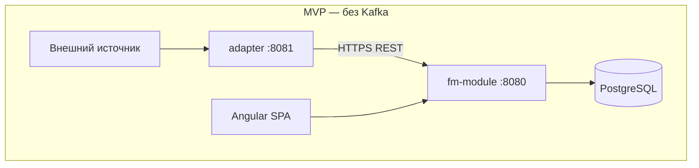
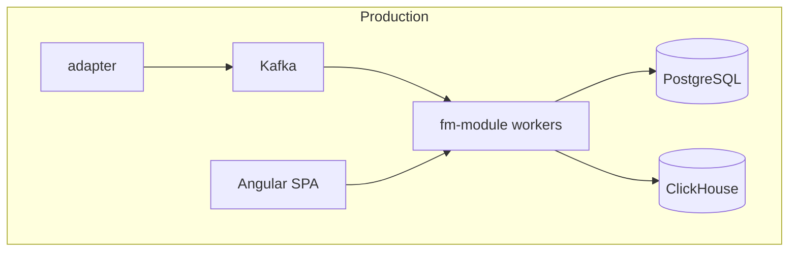

# Технологический стек — WISLA Fault Management

**Версия:** 1.0  
**Источник:** `docs/requirements.md`, `docs/pages-spec.md`  
**Статус:** утверждён заказчиком (оркестратор)

---

## Recommended (Approved)

| Layer | Choice | Rationale |
|-------|--------|-----------|
| **Backend** | Java 25, Spring Boot 3.x | Прямое соответствие технологическому ориентиру ТЗ (Java); зрелая экосистема для транзакционной обработки событий, ЖЦ, правил корреляции и REST API. Spring Boot — стандарт для enterprise-мониторинга на OEL/RedOS/Astra; удобная интеграция с PostgreSQL, Liquibase, JWT, OpenAPI. |
| **Migrations** | Liquibase | Версионирование схемы PostgreSQL в коде; воспроизводимые миграции для MVP и production; согласуется с Java/Spring-стеком и требованием транзакционности NFR. |
| **Frontend** | Angular 18+ | ТЗ допускает React или Angular; для Monq-style NOC-консоли (sidebar, тяжёлые таблицы, конструктор запросов, карты фильтров, тепловые карты) Angular даёт структурированный модульный UI, встроенный routing, forms и i18n для полной русификации. |
| **DB MVP** | PostgreSQL 15+ only | Оперативные данные (события, КЕ, источники, правила, пользователи, журнал действий) в одной БД — достаточно для демо-сценария MVP; упрощает развёртывание и Testcontainers. История действий и бизнес-аудит — в PostgreSQL до подключения ClickHouse. |
| **DB Production** | PostgreSQL (operational) + ClickHouse (history/analytics) | Соответствует NFR и п. 1.5 ТЗ: PG — транзакционные оперативные данные и конфигурация; ClickHouse — журнал действий, история атрибутов событий, аналитика и отчётность при высоком объёме записей. |
| **Auth** | JWT, локальные пользователи (seed) для MVP | MVP: seed-пользователи по ролям (дежурный, специалист, администратор) без AD; JWT в заголовке Bearer для SPA и API адаптера. Post-MVP: LDAP/AD с TLS (п. 5.4 requirements). |
| **API** | REST + OpenAPI 3.1 | Паритет UI и API (NFR); контракт для адаптера (`/api/v1/ingest`), консоли, админки; OpenAPI 3.1 — единый источник для генерации клиентов и документации. |
| **Services** | `adapter` (отдельный), `fm-module` (backend + UI BFF) | Разделение по ТЗ п. 9: адаптер — приём Push/Pull, буфер, heartbeat; модуль — нормализация, правила, хранилище, веб-UI. `fm-module` — единый deployable unit (Spring Boot + статика Angular); адаптер — отдельный Spring Boot-сервис. |
| **Message broker MVP** | none | Синхронный HTTPS adapter → fm-module; обработка в процессе модуля; без лишней инфраструктуры для демо. |
| **Message broker Prod** | Apache Kafka | Асинхронная decoupling приёма и обработки, буферизация при шторме, горизонтальное масштабирование воркеров правил; соответствует кластерной архитектуре полного ТЗ. |
| **Deploy MVP** | Docker Compose (local), `baseUrl` `http://localhost:8080` | Локальный стенд: PostgreSQL, `fm-module`, `adapter`; единая точка входа UI и API на порту 8080. |
| **Deploy Prod** | Remote server via SSH | Развёртывание на выделенных серверах (WEB, приложения, БД) по OEL/RedOS/Astra; скрипты SSH-deploy без обязательного Kubernetes на первом этапе. |
| **Tests (backend)** | JUnit 5 + Testcontainers | Интеграционные тесты с реальным PostgreSQL в контейнере; покрытие ingestion API, ЖЦ, правил дедупликации. |
| **Tests (frontend)** | Jasmine/Karma или Jest + Playwright | Unit — компоненты консоли, конструктора запросов; E2E — демо-сценарий MVP (5 шагов) по маршрутам из `pages-spec.md`. |

### Обоснование по слоям (WISLA FM + Monq UI)

**Backend (Java / Spring Boot).** Модуль FM выполняет цепочку Monq-аналога: приём → нормализация → правила → сигнал в консоль. Spring обеспечивает DI для движка правил, транзакционную запись в PostgreSQL, REST-контроллеры под OpenAPI. Адаптер на том же стеке упрощает общие DTO и контракты.

**Frontend (Angular).** `pages-spec.md` описывает Monq-паттерны: фиксированный sidebar, тёмная тема (`#1a1d23`–`#252830`), таблица с пакетной подгрузкой (500 строк), конструктор запросов, карты событий, тепловая карта «Здоровье продуктов». Angular Material или кастомная design system — тёмная палитра и severity-цвета; polling 1 мин (MVP) через `HttpClient` + interval.

**Данные.** MVP: все сущности (`Event`, `ConfigurationItem`, `EventSource`, `ProcessingRule`, `EventActionLog`) в PostgreSQL. Production: оперативный срез и конфигурация остаются в PG; `EventActionLog`, `EventHistory`, агрегаты для `/reports` — репликация/запись в ClickHouse.

**Auth.** JWT выдаётся при `/login`; роли из seed определяют матрицу `pages-spec.md`. Сервисная учётная запись адаптера — отдельный API-ключ / Bearer для `ingest`.

**Сервисы.**





| Сервис | Путь | Ответственность |
|--------|------|-----------------|
| **adapter** | `backend/adapter/` | Push REST webhook, проксирование в модуль; предфильтрация; локальный буфер; heartbeat. Post-MVP: SNMP Trap, Pull ETL. |
| **fm-module** | `backend/fm-module/` + `frontend/` | Ingestion API, processing engine, PostgreSQL, REST для UI, раздача Angular static, BFF-агрегация для дашбордов. |

### MVP vs Production

| Аспект | MVP | Production |
|--------|-----|------------|
| **База данных** | PostgreSQL 15+ only | PostgreSQL + ClickHouse |
| **Брокер сообщений** | Нет (прямой HTTPS) | Kafka |
| **Аутентификация** | JWT, локальные seed-пользователи | + LDAP/AD (TLS), сервисные учётки |
| **Адаптер** | Push REST | + SNMP, Pull ETL, готовые скрипты |
| **Интеграции** | Заглушки (ITSM поле) | WISLA, ITSM, Email/Telegram |
| **Консоль live** | HTTP polling (~1 мин) | Polling или WebSocket |
| **Deploy** | Docker Compose, `localhost:8080` | SSH на удалённые серверы, резервирование |
| **Масштаб** | Single instance | Кластер, горизонтальное масштабирование |

### Ограничения проекта (не входят в стек)

Явные исключения из `docs/requirements.md` п. 7 — **не проектируются и не добавляются** в зависимости:

| Исключение | Влияние на реализацию |
|------------|----------------------|
| **Обработка ошибок** | Нет глобальных error handlers, retry-политик платформы, DLQ, unified error reporting. Допускается стандартное поведение Spring/Angular без кастомной подсистемы. |
| **Метрики** | Нет Prometheus, OpenTelemetry, внутренних counters. Передача метрик FM в WISLA — вне объёма. |
| **Логирование приложения** | Нет structured logging, ротации, экспорта логов. **Журнал действий** (`EventActionLog`) — доменный бизнес-аудит в БД, не application logging. Статус Pull-заданий — поля источника в UI (`last_success_at`, статус), не logging-подсистема. |

### Trade-offs (утверждённый стек)

| Критерий | Оценка |
|----------|--------|
| Сложность | Средняя: два Java-сервиса + Angular; проще production-стека без Kafka/ClickHouse на MVP |
| Time-to-MVP | Хорошая: PG-only, без брокера; знакомый enterprise-стек |
| Масштабируемость | Высокая в production за счёт Kafka + PG/CH split |
| Соответствие ТЗ | Прямое: Java, Angular, PostgreSQL, ClickHouse (post-MVP), Monq UX |

---

## Alternative A

**Кратко (для архива):** Node.js + Express + TypeScript (backend), React + Vite + TypeScript + Tailwind (frontend).

| Layer | Choice |
|-------|--------|
| Backend | Node.js 20+, Express, TypeScript |
| Frontend | React 18, Vite, Tailwind |
| DB | PostgreSQL 15+ |
| Tests | Vitest + supertest, Vitest + Playwright |

**Плюсы:** быстрый прототип, единый язык на fullstack, шаблоны в `templates/` репозитория.  
**Минусы:** слабее alignment с ТЗ (Java как приоритет); для тяжёлой NOC-консоли Monq-стиля потребуется больше UI-библиотек с нуля.  
**Почему не выбран:** заказчик утвердил Java + Angular.

---

## Alternative B

**Кратко (для архива):** Java/Spring backend + React frontend (гибрид ТЗ).

| Layer | Choice |
|-------|--------|
| Backend | Java 21, Spring Boot 3.x |
| Frontend | React 18, Vite |
| DB | PostgreSQL + ClickHouse (сразу) |
| Events | Kafka с MVP |

**Плюсы:** backend как в ТЗ; React — больше разработчиков на рынке.  
**Минусы:** ранняя сложность (Kafka + CH в MVP); расхождение с Monq-style Angular SPA для enterprise NOC; дольше time-to-MVP.  
**Почему не выбран:** утверждён Angular; MVP без Kafka и ClickHouse.

---

## Decision

**Утверждённый стек (заказчик):**

| Layer | Choice |
|-------|--------|
| Backend | Java 25 (Spring Boot 3.x) |
| Migrations | Liquibase |
| Frontend | Angular 18+ |
| DB MVP | PostgreSQL 15+ only |
| DB Production | PostgreSQL (operational) + ClickHouse (history/analytics) |
| Auth | JWT, local users (seed) for MVP |
| API | REST + OpenAPI 3.1 |
| Services | adapter (separate), fm-module (backend+UI BFF) |
| Message broker MVP | none |
| Message broker Prod | Kafka |
| Deploy MVP | Docker Compose local, baseUrl `http://localhost:8080` |
| Deploy Prod | remote server via SSH |
| Tests | JUnit 5 + Testcontainers (backend), Jasmine/Karma or Jest + Playwright (frontend) |

**Структура репозитория (целевая):**

```
backend/
  adapter/          # Spring Boot — приём Push, буфер, heartbeat
  fm-module/        # Spring Boot — API, processing, Liquibase, static Angular
frontend/           # Angular 18+ SPA → build в fm-module
docs/
  fm-module/api.yaml
  adapter/api.yaml
```

**Следующие шаги:** Architect (05) — `docs/architecture.md`; API Designer (06) — OpenAPI и `db.md` per service.

---

*Документ подготовлен Tech Advisor (agent 02). Решение зафиксировано оркестратором.*
