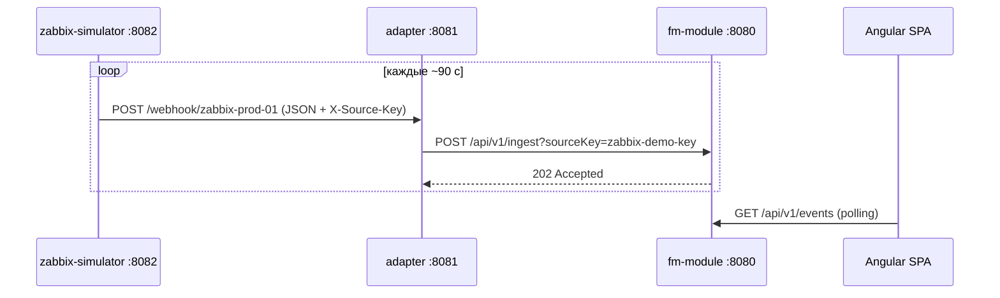

# Zabbix Simulator — имитация мониторинга для MVP

**Сервис:** `backend/zabbix-simulator/`  
**Порт:** `8082`  
**Роль:** периодически отправляет webhook-события в формате **Zabbix 6.x Media Type** на WISLA FM Adapter, имитируя реальный Zabbix Server.

---

## Зачем

Для демо-сценария MVP без развёрнутого Zabbix:

1. Simulator → `POST adapter:8081/webhook/zabbix-prod-01`
2. Adapter → `POST fm-module:8080/api/v1/ingest`
3. События появляются в **Консоли** (`/console`) со статусом **Новое**

---

## Архитектура



---

## Формат payload (как в Zabbix Webhook)

Поля соответствуют макросам Zabbix Media Type:

| Поле | Zabbix macro | Пример |
|------|--------------|--------|
| `host`, `hostname` | `{HOST.NAME}` | `demo-server.wisla.local` |
| `host_ip` | `{HOST.IP}` | `10.10.1.21` |
| `trigger_id` | `{TRIGGER.ID}` | `10001` |
| `trigger_name` | `{TRIGGER.NAME}` | `High CPU utilization (>90% for 5m)` |
| `trigger_severity` | `{TRIGGER.SEVERITY}` | `High`, `Disaster`, `Warning` |
| `event_id` | `{EVENT.ID}` | `10042` |
| `event_nseverity` | `{EVENT.NSEVERITY}` | `0`–`5` (Zabbix numeric) |
| `event_value` | `{EVENT.VALUE}` | `1` = PROBLEM, `0` = OK (recovery) |
| `item_key` | `{ITEM.KEY}` | `system.cpu.util[,idle]` |
| `item_value` | `{ITEM.VALUE}` | `92.4` |
| `message` | custom | текст алерта |
| `zabbix_url` | `{ZABBIX.URL}` | URL инсталляции Zabbix |

Adapter маппит `event_nseverity` / `trigger_severity` → severity FM и `event_value=0` → status `closed`.

---

## Seeded источник в fm-module

| Параметр | Значение |
|----------|----------|
| Имя | Zabbix Main (simulator) |
| Webhook path key | `zabbix-prod-01` |
| API key | `zabbix-demo-key` |
| Webhook URL | `http://localhost:8081/webhook/zabbix-prod-01` |
| Webhook URL (adapter-2) | `http://localhost:8083/webhook/zabbix-prod-01` |

Adapter подтягивает конфиг источников из fm-module (`GET /api/v1/internal/sources`) при старте.

**Подключение к второму адаптеру:** [`docs/adapter/connect-zabbix-source.md`](adapter/connect-zabbix-source.md)

---

## Сценарии (встроенные)

| ID | Host | Trigger | Severity |
|----|------|---------|----------|
| `cpu-high` | demo-server.wisla.local | High CPU utilization | High (4) |
| `disk-space` | db-prod-01.moscow.company.ru | Disk space critically low | Disaster (5) |
| `service-down` | web-app-03.moscow.company.ru | Zabbix agent unavailable | Average (3) |
| `memory-warning` | demo-server.wisla.local | High memory utilization | Warning (2) |
| `network-errors` | core-sw-01.dc1.company.ru | Interface errors rate high | High (4) |

~35% тиков отправляют **recovery** (`event_value=0`) для активных проблем.

---

## Запуск

### Docker Compose (рекомендуется)

```powershell
cd C:\Project\wislaFaultManagement\backend
docker compose up -d --build
```

Проверка:

```powershell
curl http://localhost:8082/health
curl http://localhost:8081/health
```

### Локально (Maven)

```powershell
$env:JAVA_HOME = "C:\Java\LibericaJDK-25"
cd backend\zabbix-simulator
mvn spring-boot:run
```

---

## API симулятора

| Method | Path | Описание |
|--------|------|----------|
| GET | `/health` | Статус, число активных проблем |
| GET | `/scenarios` | Список сценариев |
| POST | `/tick` | Отправить один тик (problem или recovery) |
| POST | `/scenarios/{id}/fire?recovery=false` | Принудительно сценарий |
| POST | `/scenarios/cpu-high/fire?recovery=true` | Recovery для сценария |

Пример ручного PROBLEM:

```powershell
curl -X POST http://localhost:8082/scenarios/disk-space/fire
```

---

## Переменные окружения

| Variable | Default | Description |
|----------|---------|-------------|
| `SIMULATOR_ENABLED` | `true` | Вкл/выкл автотик |
| `ADAPTER_BASE_URL` | `http://localhost:8081` | Базовый URL adapter (эмулятор **не** вызывает fm-module) |
| `SOURCE_WEBHOOK_KEY` | `zabbix-prod-01` | Сегмент path: `POST {ADAPTER_BASE_URL}/webhook/{key}` |
| `ADAPTER_WEBHOOK_URL` | *(пусто)* | Опционально: полный URL webhook (override base+key) |
| `ZABBIX_SOURCE_API_KEY` | `zabbix-demo-key` | Header `X-Source-Key` для adapter |
| `ZABBIX_URL` | `https://zabbix.wisla.local` | Поле `zabbix_url` в payload |
| `SIMULATOR_INTERVAL_SEC` | `90` | Интервал автотика |
| `SIMULATOR_INITIAL_DELAY_SEC` | `30` | Задержка первого тика |
| `SIMULATOR_RECOVERY_PROBABILITY` | `0.35` | Вероятность recovery |

---

## Проверка end-to-end

1. `docker compose up -d --build`
2. Подождать ~45 с (initial delay)
3. Открыть http://localhost:8080/console — login `admin` / `admin`
4. Должны появиться события с FQDN из сценариев
5. `curl http://localhost:8082/health` — `active_problems` > 0 после problem-тиков

---

## Связанные документы

- [`docs/zabbix-simulator/api.yaml`](zabbix-simulator/api.yaml) — OpenAPI контракт control API
- [`docs/adapter/api.yaml`](adapter/api.yaml) — контракт webhook
- [`backend/adapter/README.md`](../backend/adapter/README.md)
- [`docs/requirements.md`](requirements.md) §8.1 MVP
